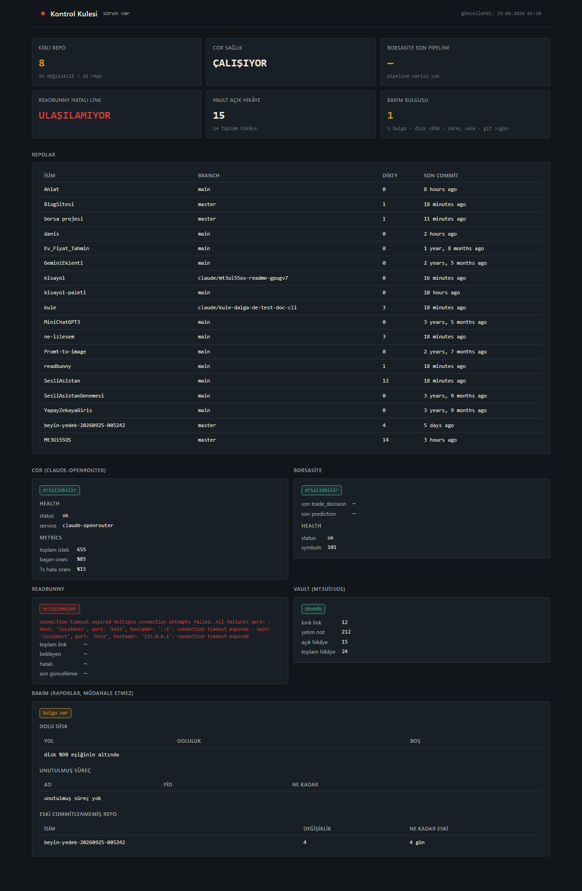

# kule



Türkçe · [English](README.en.md)

## Açıklama

Umut'un projelerinin durumunu tek panelde toplayan kontrol kulesi. Git
repolarının durumu, cor (claude-openrouter) proxy sağlığı, BorsaSite
pipeline'ının son çalışması, readbunny veritabanı durumu, Mt3Ui55OS
vault'unun hijyeni, atlas/orkestra'nın durum sayıları ve otomatik
bakım uyarıları (dolu disk, unutulmuş süreçler, eski commitlenmemiş
değişiklik) — hepsi tek bir koyu temalı web panelinde, 30 saniyede bir
kendini tazeleyen tek sayfada.

Offline-first değil: kule kendi başına veri üretmez, dokuz farklı
kaynağa (dosya sistemi, HTTP, Postgres, alt süreç) bağlanıp onları okur.
Bir kaynağa ulaşılamazsa panel çökmez — o kaynağın kartı "erişilemiyor"
gösterir, diğerleri etkilenmez.

> **Not:** kule kişisel bir araçtır; bazı kaynaklar yazarın makinesine özgüdür (yerel cor proxy'si,
> bir Markdown vault'u, atlas/orkestra/harita komut satırı araçları, BorsaSite ve readbunny servisleri).
> Hiçbiri zorunlu değildir: yapılandırılmamış ya da ulaşılamayan kaynağın kartı "erişilemiyor"
> gösterir. Testler bu araçlar kurulu olmadan da çalışır (ilgili testler atlanır).

## Kurulum

```bash
pip install -e .
cp config.yaml.example config.yaml
```

`config.yaml`'ı kendi yollarınla/URL'lerinle doldur (aşağıda alan
alan açıklandı). `config.yaml` `.gitignore`'da — commit edilmez, her
makinede yerel kalır.

## Çalıştırma

```bash
kule                      # sunucuyu başlatır (127.0.0.1:8790)
kule --port 8000 --reload # ek seçenekler
uvicorn app.main:app      # doğrudan uvicorn da çalışır
```

Panel `http://127.0.0.1:8790` adresinde açılır. `config.yaml` yoksa
sunucu yine de ayağa kalkar, ama `/` ve `/api/summary` 500 döndürüp
`config.yaml.example`'ı kopyalamanı söyler (reverse proxy health-check
gibi şeylerin config'den bağımsız çalışabilmesi için sunucu hiç
başlamamak yerine bu yolu seçiyor).

### Tek seferlik durum bildirimi

```bash
kule --notify-once
```

Sunucuyu **başlatmaz**; dokuz kaynağı bir kez okur, herhangi biri
erişilemiyorsa ya da hata veriyorsa, ya da otomatik bakım bir şey
bulduysa uyarıyı Telegram'a gönderir ve stdout'a basar. Sorun yoksa
`kule: her şey yolunda` basar ve hiç mesaj göndermez. Her durumda exit
code `0` döner — cron gibi zamanlanmış görevlerde "sorun var" durumu hata
sayılmaz:

```cron
*/15 * * * * /path/to/venv/bin/kule --notify-once
```

Gönderim için `telegram.bot_token`/`chat_id` dolu olmalı; boşsa
Telegram'a hiç istek atılmaz, sadece uyarı stdout'a basılır.

## config.yaml alanları

```yaml
repo_roots:              # git repoları için taranacak kök dizinler
  - ~/Desktop             # ~ ve $ENV_VAR genişletilir
  - ~/Documents           # her kökten en fazla 4 seviye derine inilir

cor:
  base_url: "http://127.0.0.1:8787"   # cor'un çalıştığı adres

borsasite:
  health_url: "https://.../api/health"  # BorsaSite'ın health endpoint'i
  database_url: ""    # opsiyonel — boşsa yalnızca HTTP health kullanılır,
                       # doluysa trade_decisions/predictions tablolarından
                       # son çalışma zamanı da çekilir

readbunny:
  database_url: "postgresql://..."   # readbunny'nin Postgres bağlantısı
                                      # (links tablosundan özet okunur)

vault:
  path: "/path/to/vault"   # vault'un yerel yolu

maintenance:                    # hepsi OPSİYONEL — eksik alan default'a düşer
  disk_threshold_percent: 90    # bu oranın üstünde dolu diskler uyarılır
  stale_process_hours: 6       # bu süreden uzun çalışan süreçler "unutulmuş" sayılır
  stale_git_days: 3             # kirli repoda bu günden eski değişiklik varsa uyarılır
  process_names: [ollama, uvicorn, node]  # izlenecek süreç adı kalıpları
  # disk_paths: []              # boşsa repo_roots, o da boşsa "/" kontrol edilir

atlas:                          # OPSİYONEL — `atlas durum --json` çalıştırılır
  komut: ["atlas"]             # string ya da liste olabilir
  zaman_asimi: 15              # saniye; bozuk/sıfır/negatifse 15

orkestra:
  komut: ["orkestra"]
  zaman_asimi: 15

telegram:
  bot_token: ""   # `kule --notify-once` bununla uyarı gönderir
  chat_id: ""     # env'den de okunabilir: KULE_TELEGRAM_BOT_TOKEN / KULE_TELEGRAM_CHAT_ID
```

Telegram secret'ları `config.yaml`'a yazmak zorunda değilsin — ortam
değişkeni yaml'daki değerin önüne geçer, secret repo'ya hiç girmez.

## Uçlar

- **`GET /`** — panelin kendisi (tek HTML sayfa, CSS/JS gömülü, build
  adımı yok). Sayfa yüklenince ve her 30 saniyede bir `/api/summary`'yi
  çeker, gelen JSON ile DOM'u doldurur. Bir istek başarısız olursa
  ekranda son bilinen veri kalır, sadece sessiz bir "bağlantı koptu"
  rozeti görünür.
- **`GET /api/summary`** — dokuz kaynağın JSON özeti:

  ```json
  {
    "git": [{"name", "path", "branch", "dirty_count", "son_commit"}, ...],
    "cor": {"reachable", "health", "dashboard_health", "metrics"},
    "borsasite": {"reachable", "health", "db": {"last_trade_decision", "last_prediction"}},
    "readbunny": {"reachable", "last_updated", "error_count", "pending_count", "total_count"},
    "vault": {"broken_link_count", "orphan_note_count", "open_threads", "total_threads"},
    "maintenance": {
      "disk": {"threshold_percent", "full": [{"path", "percent", "free_gb"}]},
      "stale_processes": {"min_hours", "names", "items": [{"pid", "name", "hours"}]},
      "stale_git": {"min_days", "items": [{"name", "dirty_count", "age_days"}]}
    },
    "atlas": {
      "reachable": true, "son_tarama": "2026-09-30T08:00:00+00:00", "veri_bayat": false,
      "push_bekleyen": 2, "push_bilinmeyen": 1,
      "bayat_readme": 4, "bulgu_toplam": 5, "bulgu_onem": {"guvenlik": 2}, "todo_toplam": 40
    },
    "orkestra": {
      "reachable": true, "gorev_toplam": 14, "onay_bekleyen": 1,
      "kanitsiz_ya_da_supheli": 2, "basarisiz": 1,
      "gorev_durum": {"onay-bekliyor": 1, "tamamlandi": 13},
      "kota": {"gun": "2026-09-30", "toplam_istek": 87, "uyari_sayisi": 1, "veri_var": true}
    },
    "collected_at": 1234567890.0
  }
  ```

  Her kaynak kendi try/except'inde izole edilir; biri patlarsa o
  anahtar `{"error": "..."}` olur, diğerleri etkilenmez. Sonuç 60
  saniye boyunca process-içi bellekte önbelleklenir (art arda hızlı
  istekler gerçek collector'ları tekrar tetiklemez).

  `atlas`/`orkestra` **bilinmeyen sayıları `null` olarak** döner —
  `null` "ölçemedim" demektir, `0` "ölçtüm ve sıfır" demektir; panelde
  "bilinmiyor" yazar, 0 göstermez. Bir sayı alanı int değilse ya da
  çıktı sözleşmeye uymuyorsa (`surum != 1`, yanlış `kaynak`, JSON değil)
  tüm kaynak `{"reachable": false, "error": "cikti_gecersiz"}` olur.

`kule --notify-once` bu özeti okuyup sorunlu kaynakları kısa bir Türkçe
uyarı metnine çevirir (`app/notifier.py::build_alert_message`): `cor`
erişilemiyor, `vault` hata veriyor, `git`'te 2 repo okunamadı gibi.
`collected_at` bir kaynak değildir, uyarı üretmez.

### Paneldeki bakım kartı

Aynı `maintenance` verisi panelde de görünür: üstteki kutular arasındaki
**"bakım bulgusu"** sayacı (dolu disk + unutulmuş süreç + eski
commitlenmemiş repo toplamı, altında eşikler), altta ise **bakım** kartı —
dolu disk, unutulmuş süreç ve eski commitlenmemiş repo listeleri ayrı
ayrı tablolarda. Hiçbir bulgu yokken sakin bir "her şey yolunda" durumunda
kalır; bir alt bölüm okunamazsa (ör. `psutil` kurulu değilse süreçler)
rozet kırmızıya döner, diğer iki liste normal görünmeye devam eder.
Bulgu, üst bardaki durum noktasını da "dikkat gerektiren nokta var"
durumuna taşır — panel ile Telegram uyarısı aynı bulguyu aynı ciddiyetle
gösterir.

## atlas / orkestra (`durum --json`)

Bu iki proje kule'ye **yalnızca sayı** konuşur. Her biri kendi CLI'sine
`durum --json` alt komutunu ekler, kule bunu `subprocess` ile çağırır:

```bash
atlas durum --json
orkestra durum --json
```

> **Rol ayrımı: `git` kartı ile atlas örtüşmez.** `git` kartı ve
> `maintenance.stale_git` **canlı çalışma ağacını** ölçer (kirli repo, repo
> tablosu, en eski commitlenmemiş değişiklik). atlas ise `git status`'un
> gösteremediklerini taşır: pushlanmamış commit, README bayatlığı, sızıntı
> bulgusu, todo. atlas `kirli_repo`/`repo_sayisi` alanlarını sözleşmede
> gönderir ama kule bunları **okumaz**: taramanın yapıldığı andan kalırlar,
> farklı kök ve derinlikle taranırlar ve aynı şeyi iki farklı sayıyla
> gösterirlerdi.

> **harita** da aynı sözleşmeyi konuşur (`harita durum --json`,
> `app/collectors/harita_status.py`) ama panelde **kartı yok**: kırık link ve
> yetim not için `vault` kartı kullanılır. Yetim tanımı harita'nınkiyle
> aynıdır: ne link alan ne link veren, kökteki `.md` dosyaları ve `daily/`
> günlükleri hariç (makine her oturumda günlük yazar, bunlar yüzlerce sahte
> "yetim" üretirdi). `.claude`, `receipts`, `.obsidian`, `.git`, `.agents`,
> `node_modules`, `📥 000-Inbox/Dump` sayıma girmez.

Ortak kurallar (bkz. `app/collectors/durum_status.py`):

- Kule **ağa çıkmaz, hiçbir şeyi değiştirmez**, yalnızca stdout'taki tek
  JSON nesnesini okur. `shell=False` + argv listesiyle çağrılır.
- Çıktı doğrulanır: geçerli JSON nesnesi, `surum == 1`, `kaynak` beklenen
  ad, sayılar `int >= 0` (`bool` sayılmaz). **Bilinmeyen alanlar yok
  sayılır** — kaynak yeni alan eklerse kule bozulmaz.
- Alt sürecin **stdout/stderr'i, komut yolu, ortam değişkeni ve istisna
  metni asla** panele ya da Telegram'a girmez. Panele yalnızca doğrulanmış
  sayılar ve sabit hata kodları çıkar.
- `KULE_TELEGRAM_*` ortam değişkenleri alt sürece **geçirilmez** — kule'nin
  Telegram secret'ı alt süreçten görünmez.
- Komut bulunamazsa / süreç zaman aşımına uğrarsa / sıfırdan farklı kod
  dönerse sabit kodlar: `config_yok`, `komut_yok`, `zaman_asimi`,
  `cikti_gecersiz`, `bilinmeyen_hata`. Kaynağın kendi `hata` kodu sabit
  listedeki kodlardan biriyse o iletilir (`db_yok`, `indeks_yok`,
  `okunamadi`), değilse içeriği ne olursa olsun `bilinmeyen_hata` yazılır.

### Panel ve Telegram ayrımı

Panel her sayıyı gösterir. Telegram **dar** koşullarda uyarır — spam
olmasın diye, yalnızca gerçek arıza/uyumsuzluk:

| Kaynak | Telegram'a gider | Yalnızca panelde |
|---|---|---|
| atlas | (yalnızca erişilememe) | `veri_bayat` (sarı), `bayat_readme`, `push_bekleyen` |
| orkestra | `onay_bekleyen > 0` | `basarisiz` (birikir, iptal edilene dek düşmez), `kanitsiz_ya_da_supheli`, `kota.uyari_sayisi` |

Sağ sütundakiler sürekli `> 0` olan inceleme sayaçlarıdır; her koşuda
basılmaları bildirimi değersiz kılardı. İki kaynağın **erişilememesi**
uyarıdır; yapılandırılmamış (`config_yok`) kaynak "izlenmiyor" sayılır, uyarmaz.
`veri_bayat` bilerek Telegram'a gitmez: atlas taraması elle yenilenir,
bayatlık uzun süre kalıcı olabilir ve her cron çalışmasında mesaj üretirdi.

## Otomatik bakım botu (Dalga F)

`maintenance` kaynağı üç şeyi otomatik tespit eder — **yalnızca raporlar**,
hiçbir müdahale yapmaz (süreç öldürülmez, dosya silinmez, git komutu
çalıştırılmaz):

- **Disk doluluğu** — `shutil.disk_usage` ile `disk_paths` (yoksa
  `repo_roots`, o da yoksa `/`) kontrol edilir; `disk_threshold_percent`
  üstü dolu olanlar listelenir.
- **Unutulmuş süreçler** — `psutil` ile `process_names` kalıbına uyan ve
  `stale_process_hours`'tan uzun süredir çalışan süreçler listelenir.
  `psutil` kurulu değilse yalnızca bu bölüm `error` döner.
- **Eski commitlenmemiş değişiklik** — `git_status` zaten repoları taradığı
  için o çıktı yeniden kullanılır: **kirli** olan repoların en son dosya
  değişikliği `stale_git_days`'ten eskiyse listelenir.

`--notify-once` çıktısı bu bulguları diğer kaynaklarla aynı Türkçe uyarı
metnine, her biri ayrı satır olarak ekler:

```
⚠️ kule uyarısı: cor erişilemiyor (kapalı)
disk dolu: / (%95.2)
uzun süredir çalışan süreçler: ollamax2, uvicorn
eski commitlenmemiş değişiklik: kule, borsa
🕐 2026-09-28 10:20
```

Hiçbir bakım bulgusu yoksa (ve hiçbir kaynak sorunlu değilse) mesaj
üretilmez, `kule: her şey yolunda` basılır.

## Lisans

MIT, bkz. [LICENSE](LICENSE).
